  <picture>
    <source media="(prefers-color-scheme: dark)" srcset="./header.svg" />
    <source media="(prefers-color-scheme: light)" srcset="./header-light.svg" />
    
  </picture>

  

    Tech Stack🔺
    
  

   
  

  
  
  
  
  
  
  
  
  
  
  
  

  <small>and many more...</small>

<picture>
  <source media="(prefers-color-scheme: dark)" srcset="https://raw.githubusercontent.com/wiesty/wiesty/output/github-snake-dark.svg" />
  <source media="(prefers-color-scheme: light)" srcset="https://raw.githubusercontent.com/wiesty/wiesty/output/github-snake.svg" />
  
</picture>

